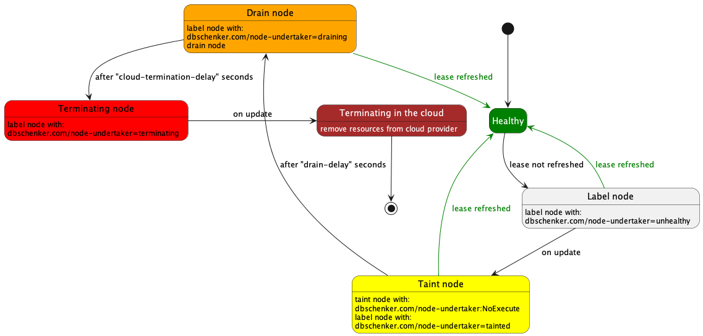

# Node undertaker

Node-undertaker is a tool that was built to address handling Kubernetes nodes that are unhealthy.

Kubernetes itself marks such nodes and then using NoExecute taint removes pods out of them. But such a node still
runs in the cloud provider and consumes resources. This tool detects such nodes and terminates them in the cloud provider.

Currently supported cloud providers:
* AWS
* kind (for testing & development)
* kwok (for testing & development)

## How it works

This tool checks every minute all the nodes if they have "fresh" lease in a namespace.
It can check leases in the kube-node-lease namespace (created by kubelet) or any other namespace that contains similar leases (for custom healthchecking solution).




## Getting started

### Cloud provider setup

Before you can start node-undertaker it needs credentials with access granted to cloud provider.

#### AWS
For AWS node-undertaker requires to have granted IAM role with following policy:

```json
{
   "Version": "2012-10-17",
   "Statement": [
      {
         "Effect": "Allow",
         "Action": [
            "ec2:TerminateInstances",
            "autoscaling:DescribeAutoScalingInstances",
            "autoscaling:DescribeTrafficSources",
            "elb:DeregisterInstancesFromLoadBalancer",
            "elbv2:DeregisterTargets"
         ],
         "Resource": "*"
      }
   ]
}
```

In case there are more resources than one cluster it is advised to limit access to only one cluster's resources (for example by using Conditions). Example policy for cluster named CLUSTER_NAME: 

```json
{
   "Version": "2012-10-17",
   "Statement": [
      {
         ...
         "Condition": {
            "StringLike": {
               "ec2:ResourceTag/kubernetes.io/cluster/CLUSTER_NAME": "owned"
            }
         }
      }
   ]
}
```

### Installation
#### With helm

1. First add helm chart repository:
   ```
   helm repo add dbschenker https://dbschenker.github.io/node-undertaker
   ```
2. Install helm chart
    ```shell
    helm upgrade --install --create-namespace -n node-undertaker node-undertaker node-undertaker
    ```

## Development

[//]: # (TODO write something here)