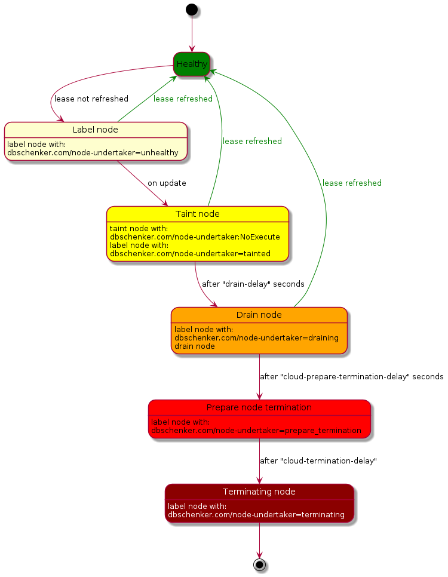

# Node undertaker

Node-undertaker is a tool that was built to address handling Kubernetes nodes that are unhealthy.

Kubernetes itself marks such nodes and then using NoExecute taint removes pods out of them. But such a node still
runs in the cloud provider and consumes resources. This tool detects such nodes and terminates them in the cloud provider.

Currently supported cloud providers:
* AWS
* kind (for testing & development)
* kwok (for testing & development)

## How it works

This tool checks every minute all the nodes if they have "fresh" lease in a namespace.
It can check leases in the kube-node-lease namespace (created by kubelet) or any other namespace that contains similar leases (for custom healthchecking solution).




## Getting started

### Cloud provider setup

Before you can start node-undertaker it needs credentials with access granted to cloud provider.

#### AWS
For AWS node-undertaker requires to have granted IAM role with following policy:

```json
{
   "Version": "2012-10-17",
   "Statement": [
      {
         "Effect": "Allow",
         "Action": [
            "ec2:TerminateInstances",
            "autoscaling:DescribeAutoScalingInstances",
            "autoscaling:DescribeTrafficSources",
            "elasticloadbalancing:DeregisterInstancesFromLoadBalancer",
            "elasticloadbalancing:DeregisterTargets"
         ],
         "Resource": "*"
      }
   ]
}
```

In case there are more resources than one cluster it is advised to limit access to only one cluster's resources (for example by using Conditions). Example policy for clusters tagged with 'kubernetes.io/cluster/CLUSTER_NAME=owned': 

```json
{
   "Version": "2012-10-17",
   "Statement": [
      {
         "Effect": "Allow",
         "Action": [
            "ec2:TerminateInstances",
            "elasticloadbalancing:DeregisterInstancesFromLoadBalancer",
            "elasticloadbalancing:DeregisterTargets"
         ],
         "Resource": "*",
         "Condition": {
            "StringLike": {
               "aws:ResourceTag/kubernetes.io/cluster/CLUSTER_NAME": "owned"
            }
         }
      },
      {
         "Effect": "Allow",
         "Action": [
            "autoscaling:DescribeAutoScalingInstances",
            "autoscaling:DescribeTrafficSources"
         ],
         "Resource": "*"
      }
   ]
}
```

### Installation
#### With helm

1. First add helm chart repository:
   ```
   helm repo add dbschenker https://dbschenker.github.io/node-undertaker
   ```
2. Install helm chart
    ```shell
    helm upgrade --install --create-namespace -n node-undertaker node-undertaker node-undertaker
    ```

## Development

### Requirements

1. golang
2. docker (for running tests)
3. (optional) kwok & kind - useful for manual testing
4. (optional) make - for convenient building

### Testing

#### With kwok
1. Create cluster & switch to its context: `make kwok`
2. Run node-undertaker locally: `make local` or run command with customized configuration
3. Create node with required configuration - examples in `example/kwok/node*.yaml`
4. (Optional) manually update node's lease with `example/kwok/create-node-lease.sh NODE_NAME kube-node-lease 100`
      * NODE_NAME - is node name which lease has to be updated
      * kube-node-lease - is the namespace that holds the leases
      * 100 - is the lease duration to set

Cleanup: `kwokctl delete cluster`

#### With kind
1. create cluster: `make kind`
2. build local image: `make docker`
3. load image to kind: `make kind_load`
4. Install with helm: `make kind_helm`

Cleanup: `kind delete cluster`

## Maintainers

This project is maintained by: 
* Kamil Krzywicki (kamil.krzywicki@dbschenker.com)
* Tobias Trabelsi (tobias.trabelsi@dbschenker.com)
